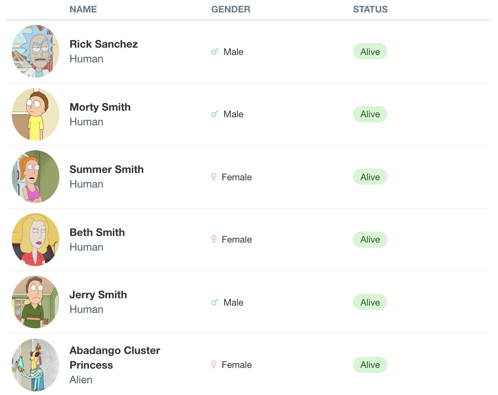

# Fast Big Data Tables in Shiny

The R package ecosystem offers a wide variety of packages that make visualizing table data in Shiny apps a breeze. However, with increasing amounts of data our app may become slow and in extreme cases crash due to insufficient memory. 

Those issues can be avoided by using **pagination** in external services outside of our app such as **REST APIs** or **databases**. In this tutorial we are going to show you how to build your own table in Shiny that uses this technique in form of an app showcasing data on Rick and Morty characters (data provided by the [Rick and Morty API](https://rickandmortyapi.com/)).

Additionally, at the end we will spend some time on beautifying our table by leveraging the custom rendering and styling features of  [reactable](https://glin.github.io/reactable/), so stay tuned until the end!

> Explore your favorite Rick and Morty characters by checking out the finished product on  [shinyapps.io](https://rszymanski.shinyapps.io/table-contest/)

> You can find the full source code on [GitHub](https://github.com/rszymanski/table-contest)

## What is Pagination?

You might have already encountered the term **pagination** when working with table packages. Usually it allows you to display a subset of the data (a page) of a fixed size and provides controls for switching between pages.

The same concept can be applied when retrieving data from REST APIs or databases. Imagine that you are sending a request that would result in a response containing millions of records. Not only will it be slow and take large amounts of your apps memory, but it might even result in a crash of your application! Instead, you can break down all of the records into pages of fixed size, fetch only the first page and display it in the UI. If the user wants to investigate data from other pages, than you can retrieve subsequent pages as needed.

Usually REST APIs that offer pagination allow you to specify the size of the page and the number of the page that you would like to retrieve. In case of the [Rick and Morty API](https://rickandmortyapi.com/) the responses are limited up to 20 documents by default. The result of an example GET request to the https://rickandmortyapi.com/api/character endpoint is provided below:

```
{
  "info": {
    "count": 826,
    "pages": 42,
    "next": https://rickandmortyapi.com/api/character?page=2,
    "prev": null
  },
  "results": [
    // up to 20 documents 
  ]
}
```

The result includes information on the amount of all records, number of pages, a url for fetching the next and previous page as well as a results section containing the content of the requested page. 

We can simulate the same behavior when querying data from a database. For example in [SQLite](https://www.sqlite.org/index.html) we can select subsets of our table by using the [LIMIT and OFFSET clauses](https://www.sqlite.org/lang_select.html#the_limit_clause) e.g. `SELECT * FROM <YOUR_TABLE> LIMIT 10 OFFSET 10;`

## Building the App
We will now go through the steps of building a Shiny app with a table that makes use of the pagination offered by the [Rick and Morty API](https://rickandmortyapi.com/). Make sure that you have the following packages installed:

```r
library(data.table)
library(glue)
library(httr)
library(reactable)
library(shiny)
```

Let's start by creating a function for retrieving a specific page of characters:
```r
fetch_page <- function(page_number) {
  url <- glue_safe("https://rickandmortyapi.com/api/character?page={page_number}")
  api_response <- GET(url = url)
  response_content <- content(api_response)
  
  retrieved_data <- rbindlist(
    lapply(
      response_content$results,
      function(character) {
        data.frame(
          image = character$image,
          name = character$name,
          gender = character$gender,
          status = character$status,
          species = character$species,
          type = character$type
        )
      }
    )
  )
  
  list(
    total_pages = response_content$info$pages,
    data = retrieved_data,
    page_count = response_content$info$count,
    next_page_url = response_content$info$`next`
  )
}
```

The UI of the app will consist of two buttons for navigating between previous and next pages and it will display the retrieved data in a table as is.

```r
ui <- fluidPage(
  actionButton("prev_page", label = "", icon = icon("angle-left")),
  actionButton("next_page", label = "", icon = icon("angle-right")),
  reactableOutput(outputId = "data_table")
)
```

On the server part, we are going to keep track of the selected page and fetch a subset of the data whenever it changes.

```r
server <- function(input, output, session) {
  page_number <- reactiveVal(1)
  
  observeEvent(input$prev_page, {
    current_page_number <- page_number()
    page_number(current_page_number - 1)
  })
  
  observeEvent(input$next_page, {
    current_page_number <- page_number()
    page_number(current_page_number + 1)
  })
  
  current_data <- reactive({
    req(page_number())
    fetch_page(page_number = page_number())
  })
  
  output$data_table <- renderReactable({
    req(current_data())
    req(nrow(current_data()$data) > 0)
    
    table_data <- current_data()$data
    
    reactable(
      data = table_data,
      sortable = FALSE,
      pagination = FALSE
    )
  })
}
```

Let's check out our app by running:
```r
shinyApp(ui, server)
```


You might wonder, whether all of that work was worth the effort. Especially in case of this example as the data source has a total of 826 characters that would easily fit into the apps memory. However, even in such a small example we can see the benefits of using pagination. Let's compare an app that uses REST API pagination to another version that fetches all of the data page by page into memory upfront and then displays it:

Pagination             |  Fetching all data upfront
:---------------------:|:-------------------------:
  |  

As you can see, the version fetching all of data upfront takes a couple of seconds before displaying the data while the version that uses pagination shows the data instantly. Moreover, the paginated version of the app takes up less memory as it only keeps one page of data in memory at a time. The benefits of this approach in terms of speed and memory usage will increase the larger our data becomes.

## Making our table more visually appealing
We managed to fix our problem with handling large size data in our table visualizations. However, the result is looking a bit raw and asks for improvements. The `reactable` package provides an interface for applying custom styling and rendering to table elements. We will leverage those features to make our table more visually appealing.

### Displaying Images Instead of Links
The image field in our response contains a link to a `.jpeg` image depicting the character from the show. Instead of displaying the link, we can display the actual image. This can be achieved by defining a custom render for the `image` column.

```r
reactable(
  data = table_data,
  sortable = FALSE,
  pagination = FALSE,
  columns = list(
    image = colDef(
      name = "",
      maxWidth = 88,
      cell = function(value) {
          img(src = value, alt = value, style = list(height = "80px", `border-radius` = "50%"))
        }
    )
  )
)
```

<p align="center">
  
</p>

### Introducing Visual Hierarchy
Our table already looks a lot better with the added image. However, all of our remaining column values currently attract the same amount of attention. Let's start by emphasizing the `name` values and de-emphasizing the `species` and `type` columns. We will make use of font weights, font sizes and color to introduce a hierarchy for those values:

```r
reactable(
  data = table_data,
  sortable = FALSE,
  pagination = FALSE,
  columns = list(
    image = // image creation function
    name = colDef(
      name = "Name",
      cell = function(value, row_index) {
        div(
          div(
            style = list(`font-weight` = "700", `font-size` = "16px"),
            value
          ),
          div(
            style = list(color = "hsl(201, 23%, 34%)", `font-size` = "16px"),
            table_data[row_index, ]$species
          ),
          div(
            style = list(color = "hsl(203, 15%, 47%)", `font-size` = "14px"),
            table_data[row_index, ]$type
          )
        )
      }
    ),
    type = colDef(show = FALSE),
    species = colDef(show = FALSE)
  )
)
```

<p align="center">
  
</p>

### Enriching Data with Color
One way of enriching table data can be achieved by introducing color. Let's make use of that in the `status` column by turning the plain text values into status pills.

```r
reactable(
  data = table_data,
  sortable = FALSE,
  pagination = FALSE,
  columns = list(
    image = ..., // create image column
    name = ... , // create name column
    type = colDef(show = FALSE),
    species = colDef(show = FALSE),
    status = colDef(
      name = "Status",
      cell = function(value) {
        styles <- list(
          `border-radius` = "16px",
          padding = "4px 12px"
        )
        
        background_color_value <- switch(
          value,
          Alive = "hsl(116, 60%, 90%)",
          unknown = "hsl(230, 70%, 90%)",
          Dead = "hsl(350, 70%, 90%)"
        )
        
        color_value <- switch(
          value,
          Alive = "hsl(116, 30%, 25%)",
          unknown = "hsl(230, 45%, 30%)",
          Dead = "hsl(350, 45%, 30%)"
        )
        
        styles$color <- color_value
        styles$`background-color` <- background_color_value
        
        
        div(
          span(value, style = styles)
        )
      }
    )
  )
)
```

<p align="center">
  
</p>

### Enriching Data with Icons
Another way of enriching the table data can be accomplished by adding icons beside the plain text values. Let's add some icons to the `gender` column.

```r
reactable(
  data = table_data,
  sortable = FALSE,
  pagination = FALSE,
  columns = list(
    image = ..., // create image column
    name = ... , // create name column
    type = colDef(show = FALSE),
    species = colDef(show = FALSE),
    status =  ..., // create status column,
    gender = colDef(
      name = "Gender",
      cell = function(value) {
        styles <- list(`margin-right` = "8px")
        
        icon_name <- switch(
          value,
          Male = "mars",
          Female = "venus",
          Genderless = "genderless",
          unknown = "question"
        )
        
        icon_color <- switch(
          value,
          Male = "lightblue",
          Female = "pink",
          Genderless = "gray",
          unknown = "hsl(31, 100%, 70%)"
        )
        
        styles$color <- icon_color
        
        div(
          icon(icon_name, style = styles),
          value
        )
      }
    )
  )
)
```

<p align="center">
  
</p>


### Finishing Touches
We already managed to improve the look of our table, however there are still some minor adjustments needed. For example, have a look at the status values, the outline of the pill is very close to the top row separator. Another thing that needs improvements are the column header values. Currently they are bold and divert attention from the character names. That can be fixed by centering the cell content vertically and making the header column names lighter.

```r
reactable::reactable(
  data = table_data,
  sortable = FALSE,
  pagination = FALSE,
  columns = ... // create columns
  theme = reactable::reactableTheme(
    cellStyle = list(
      display = "flex",
      flexDirection = "column",
      justifyContent = "center"
    )
  ),
  defaultColDef = reactable::colDef(
    headerStyle = list(`text-transform` = "uppercase",color = "hsl(203, 15%, 47%)")
  )
)
```

<p align="center">
  
</p>

Now, let's compare our result with the table that we initially started working with. You can be amazed at how much of a difference a couple of visual enhancements make on the overall look.

Before styling             |  After styling
:---------------------:|:-------------------------:
  |  
